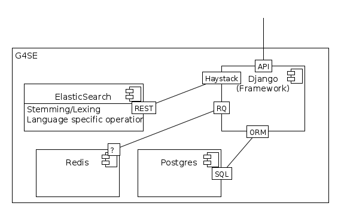

This Document provides an more technical overview of this project.

It lays out some of the (future) ideas and the current deployment and architecture.

More information can be found on the github repository of this project:
https://github.com/geometalab/G4SE-Compass

Architecture
------------

Interactions
~~~~~~~~~~~~

The interactions inside the different components can be seen in :numref:`figinterfaces`.

**Django** is the web-framework used, written in Python. It provides the basis to have the interaction
with the other components.
**Haystack** is a python-package, which provides (ElasticSearch) integration for Django.
**RQ** is Python package which provides a worker-queue (using **redis**, a key-value
store). This worker-queue is used to offload processing of the imports of the XML-data.
**Postgres** is being used as the storage database for the metadata, login and all other data,
of which the metadata is then transformed (stemmed, lexed, tokenized) and imported into
**ElasticSearch** where it then can be searched using the api (through haystack).

.. _figinterfaces:

    Components interaction inside the G4SE-system.

Data processing and search request handling
~~~~~~~~~~~~~~~~~~~~~~~~~~~~~~~~~~~~~~~~~~~

The data-preprocessing and a search request process can be found in :numref:`figsearchrequest`.

Shown in *grey* arrows the **data preparation**:
The metadata-entries from the postgres database are being passed through Haystack to ElasticSearch
where they are being tokenized, stemmed with language specific operations, lexed (according
to the rules defined through Haystack).

This indexed data serves as basis to do internal searches with the user controlled vocabulary:
for every entry in this list, the data is being searched and if found, this is being added to
the metadata-entry (both in postgres as well as the search-index).

In *black* the actual request when a search-query is being sent:
The user is presented with a user interface in his browser, which makes
direct calls to the provided (REST) API. The search-query is being passed
via Haystack to ElasticSearch, where it is being processed according
to language and similar, then the search is being executed. All matches
(this includes no matches at all) are being passed to Django via
Haystack and then transformed to JSON and passed back to the user.

.. _figsearchrequest:

    Data preparation und search request.

Deployment
----------

The Service runs on the switch cloud infrastructure (SwitchEngines). It is a
virtual server with:

* 2 cores
* 4 GB RAM
* 20 GB diskspace

It is powered by `Debian Jessie (Linux)`.

All services run on the same hardware, as shown in :numref:`figdeploymentdiagram`.

.. _figdeploymentdiagram:

    Deployment Diagram as currently in use (Switch Cloud Infrastructure)

Scaling Options
---------------

.. sidebar::
    Note: Whenever increasing the CPU-Count, also increase RAM
    otherwise the more processes are using more RAM and have to start swapping,
    which is a major cause for degraded performance.

There are multiple scaling options, some of which require more work than others.

More CPUs, RAM
~~~~~~~~~~~~~~

Assuming running with uwsgi, we need to harness the power, and because we have
elasticsearch and postgres running on the same machine, we have to take not
to degrade their performance.

A good rule of thumb, which has proven quite useful, is with N-Cores, where N is larger than 2:

N+1 processes, N/2 (if N is odd, add 0.5) threads.

Examples:

* N=2: uwsgi /uwsgi.ini --processes 3 --threads 1 (see code-snippet below)
* N=3: uwsgi /uwsgi.ini --processes 4 --threads 2
* N=4: uwsgi /uwsgi.ini --processes 5 --threads 2

.. code-block:: yaml
    version: '2'
    services:
      api:
        # your own configuration
        command: uwsgi /uwsgi.ini --processes 3 --threads 1

Adding additional Servers
~~~~~~~~~~~~~~~~~~~~~~~~~

Putting every service on it's own server has the big advantage that
scaling is possible much more easily.

This can be achieved using docker-cloud or a similar service, the
configuration for this scenario is so divers,
that it cannot be included in this documentation.

If much more power is required, the elasticsearch service can be run on a separate,
dedicated machine or even be distributed on multiple machines.
FOr Postgres the same can be done, using a master-slave configuration where for example
writes go only to master, and reads only to slave.

The application/api should of course also be run separately for maximum benefit.

Switching to a more powerful server
~~~~~~~~~~~~~~~~~~~~~~~~~~~~~~~~~~~

This is the same as more CPU, RAM, just that I use have a real world example.

Using a Hetzner Server, specifically the https://www.hetzner.de/de/hosting/produkte_rootserver/ex51ssd
with 2X500GB Harddisk, 64GB RAM and 4 Cores/8 Threads without much tweaking a load up to
600 to 700 Request per second was possible. This is more than 20 fold of what is possible
with the server above - this method might be the most cost effective way.

Data Input
----------

There are two ways for MetaData-data to be entered into the system.

Zipped-XML-Import
~~~~~~~~~~~~~~~~~

Using the Admin-Interface of Django, a zip-file containing XML-Files can be imported.
This deletes all the previously imported data (not the ones entered manually, though).

Manually added and maintained Metadata
~~~~~~~~~~~~~~~~~~~~~~~~~~~~~~~~~~~~~~

Using the Admin-Interface one can add, delete and change the Metadata that has not been
imported automatically.

Miscellaneous
-------------

Security
~~~~~~~~

Every part of the service is encapsulated:
With the client-facing server (nginx) only what is needed is exposed,
the rest of the services run on the internal network.

For authentication the standard mechanisms from the Django framework are being used,
which are considered state of the art.

Backup
~~~~~~

Daily backups of the database with retention of monthly and weekly dumps
are being made to an external location.

Monitoring
~~~~~~~~~~

The API-Service is being watched in 5 minute intervals using an external monitoring solution.

